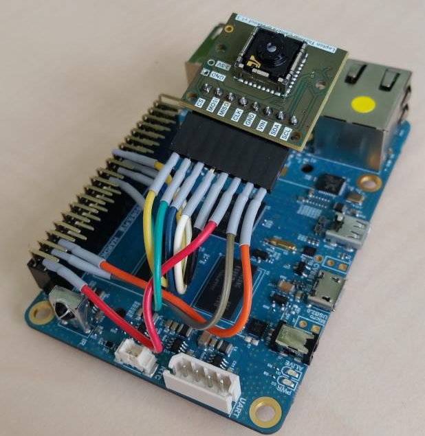
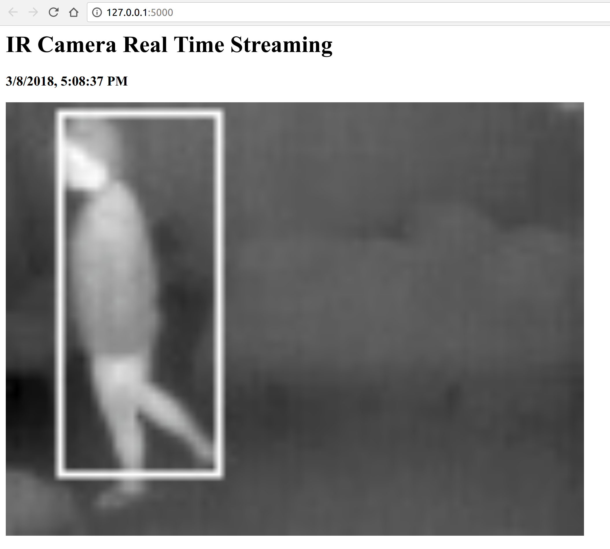

# Human Detection based on Thermal Imagery

## Introduction

This is the final year project at IMT Atlantique for students majored in computer systems and networks. The aim of the project is to detect human presence with thermal image captured from a thermal camera of an embedded linux system. Since thermal camera has less intrusion to privacy (thermal camera has no color information and it has low resolution) compared to commerical WebCams with high-resolution, we can develop services for elders and people with disabilities based on this project.

## Hardware



The hardware is composed of two parts, namely, an embedded linux system and an infrared camera, their hardware parameters are listed as follows

- Embedded linux system
    - Odroid C1
    - Processor ARM + 1 GB RAM

- Infrared camera
    - Lepton Flir
    - Resolution: 80 * 60 pixel


## Getting Started

In order to run the Human Dectection Application on your local machine for development and testing purposes, you can use recorded thermal imagery videos `test.avi` and `test1.avi` which are put at the sub-directory `./backgroundSubsctraction` and modifiy the corresponing configuration in the `web_server.py`. For example, if your are going to use the video `"./backgroundSubtraction/test.avi"` for testing purpose, just add two arguments in initializing the `IRCamera` class, as follows

```py
@app.route('/video_feed')
def video_feed():
    return Response(gen(IRCamera(test=True, file_name="./backgroundSubtraction/test.avi")),
                    mimetype='multipart/x-mixed-replace; boundary=frame')
``` 

Then open a terminal and input the following command

```sh
FLASK_APP=web_server.py flask run
```

A HTTP server will run at http://127.0.0.1:5000/, open a web browser, you can see the video streaming of the recorded video with Human Detection Algorithm running above and generating white bounding boxs that indicat detected humans.



When the video is finished, the web server will have an exception since in real case, the video streaming will never be finished

If you want to deployment the application in rather than test it on your local machine for development and testing purposes. See [deployment](#deployment) for notes on how to deploy the project on a live system.

### Prerequisites

The development is under Python 2.7, so in order to run the application, you need to install the Python 2.7 environment.

For Anaconda users, here is an example of how to create a Python 2.7 virtual environment

```
conda create --clone py27 --name py27
```

Then under the Python 2.7 development environment, you need install the following packages

- Flask==0.12.2
- matplotlib==2.1.1
- numpy==1.14.0
- opencv-python==3.4.0.12
- scikit-fuzzy==0.3.1
- scipy==1.0.0
- webencodings==0.5.1
- Werkzeug==0.14.1

you can install these packages one by one by `pip install package_name` or you can simply run the following command in your terminal

```sh
cd ./projet-p206
pip install -r requirements.txt 
```

#### Potential problems: Flask import error with Anaconda

If you have multiple version of Python installed and you have already installed Flask for one of these environment, there is a great chance that you will have a Flask import error. To solve this problem you can either consider using `virtualenvwrapper` which helps with custom Pythons and modules or you can use `conda uninstall flask` to remove pre-installed flask package in other environments in order to let the flask installed at current environment visable to you.

### Installing

To install the application in real environment, you need deploy the programs containing in `./ir_sensor` to your embedded linux system with the Flir One Thermal Camera and running the `web_server` in your machine, it's easier for configuration if the embedded linux system and your machine is directly connected or at the same sub-network.

For information about how to connect the embedded linux system directly to your machine, you can follow the instructions in the [Appendix](#direct-ethernet-connection-to-raspberry-pi-odroid-without-router)

The installing manuel is divied into the following two parts, the embedded linux system and your machine

#### Installing in the embedded linux system


#### Installing in your machine


## The Algorithm Revealed

Basically, the algorithm is an implementation of the thermal image background subtraction algorithm described in [Human Detection Based on the Generation of a Background Image and Fuzzy System by Using a Thermal Camera](http://www.mdpi.com/1424-8220/16/4/453/htm). Since the method described in this paper has the state-of-the-art performance of human presence detection with thermal imagery, this project choose to implement this algorithm as the core part for presence detection.

The method described in the paper has two main steps, namely, the Background Generation and the Human Detection. The demo of the implemention are shown below. 

### Background Generation

The demo below shows the first part of the algorithme, generating a background image.

- The top left image shows the preliminary background image obtained by median value from the sequence of images
- The top right image shows the binary image of extracted candidate human area
- The bottom left image shows the binary image of exteacted human areas by labeling, size filtering and morphological operations
- The bottom right image is the final generated background image


### Human Detection

The demo below shows the second part of the algorithme,human detection based on the generated background image.

- The top left image shows final generated background image
- The top right image shows the binary difference image between input image and generated background image, the threshold is determinded dynamically with a fuzzy system
- The bottom left image shows the binary difference image of detected human areas by labeling, size filtering and morphological operations
- The bottom right image shows the detected boxs containing of human areas on the orignal input image


## Built With

* [OpenCV](https://opencv.org/) - Open Source Computer Vision Library, based on which the human presence detection algorithm is developed
* [skfuzzy](http://pythonhosted.org/scikit-fuzzy/) - Fuzzy logic toolbox, used to build the fuzzy logic part of the algorithm
* [Flask](http://flask.pocoo.org/) - Microframework for Python, used to develop the web application

## Authors

* **Jinhai ZHOU** - 3rd year student at IMT Atlantique

## License

<a rel="license" href="http://creativecommons.org/licenses/by/4.0/"></a><br />This work is licensed under a <a rel="license" href="http://creativecommons.org/licenses/by/4.0/">Creative Commons Attribution 4.0 International License</a>.

## Acknowledgments

* Special Thanks to the patient guidance and generous help from Prof. Panagiotis PAPADAKIS and Mr. Jérôme KERDREUX
* The main alogrithm of human dection is based on the method described in the paper [Human Detection Based on the Generation of a Background Image and Fuzzy System by Using a Thermal Camera](http://www.mdpi.com/1424-8220/16/4/453/htm), I want to show my gratitude to thier works
* Thank you 

## Appendix

### Creating videos from captured thermal images for testing usage

Here is a methode to convert multiple iamges to an avi format video without compression which uses the `huffyuv encoder` in order to create a lossless output.

Enter the directory where images are saved, use an wildcard expression like `img%d.jpg` to select all the image files that are needed for this convertion, input the following commmand in a terminal

```sh
ffmpeg -i img%d.jpg -vcodec huffyuv output.avi
```

or rawvideo:

```sh
ffmpeg -i img%d.jpg -vcodec rawvideo output.avi
```

By default this will assume your input frame rate is 25, if it's not the case, you can add an option to change it:

```sh
ffmpeg -r 30 -i img%d.jpg -vcodec huffyuv output.avi
```

By default the output will inherit the input frame rate. You can apply the same option to the output. By changing the frame rates you can achieve a certain duration. For example, if I have 900 images and want the output duration to be 60 seconds with an output frame rate of 30, then we can set the output video rate to be `900/60=15 fps`.

```sh
ffmpeg -r 15 -i img%d.jpg -r 30 -vcodec huffyuv output.avi
```

Note that your images must be named in a sequence starting with 1, and although some encoders are lossless there can be some loss due to colorspace conversion. 

credit : https://ubuntuforums.org/archive/index.php/t-1815998.html


### Direct Ethernet connection to Raspberry Pi/Odroid without router

The solution is based on running DHCP service at your workstation (your notebook for example), and use it to attribute an IP address to your Raspberry Pi/Odroid. Then use ssh to connect to your Raspberry Pi/Odroid through this IP address.

Terminology | Explaination
------------ | -------------
Server | Your Single Board Computer, such as a Raspberry Pi or an Odroid
Client | Your workstation with any linux based systems, like Ubuntu


#### Configuration at the Server Side (optional)

1. Enable SSH connection
  - for Raspberry Pi
    ```bash
    sudo systemctl enable ssh
    ```
  - for Odroid
    ```bash
    sudo vim /etc/ssh/sshd_config
    ```
    find the line `PermitRootLogin` and set it to `PermitRootLogin yes`
2. Modify DHCP Client configuration
    ```
    sudo vim /etc/dhcp/dhclient.conf
    ```
    fin the line `send host-name "foo";` and uncommented it

#### Configuration at the Client Side

1. Install a DHCP server
    ```
    sudo apt-get install isc-dhcp-server
    ```

2. Use `ifconfig` to find your Ethernet network interface, it's probably **eth0** but in my case it's **enp61s0**

3. Backup your initscript of DHCP service
    ```
    sudo cp /etc/dhcp/dhcpd.conf /etc/dhcp/dhcpd.conf.orig
    ```
4. Modify the initscript of DHCP service
    ```
    sudo vim /etc/dhcp/dhcpd.conf
    ```
    
    which should be modified like the output below
    
    ```
    #Defaults for dhcp initscript
    #sourced by /etc/init.d/dhcp
    #installed at /etc/default/isc-dhcp-server by the maintainer scripts
    #
    #This is a POSIX shell fragment
    #
    #On what interfaces should the DHCP server (dhcpd) serve DHCP requests"
    #Separate multiple interfaces with spaces, e.g. “eth0 eth1".
    INTERFACES="enp61s0"
    ```
   
5. Backup your configuration file of DHCP service
    ```
    sudo cp /etc/dhcp/dhcpd.conf /etc/dhcp/dhcpd.conf.orig
    ```
  
6. Modify the configuration file of DHCP service
    ```
    sudo vim /etc/dhcp/dhcpd.conf
    ```
    
    which should be modified like the output below
    
    ```
    ddns-update-style	none;
    default-lease-time 3600;
    max-lease-time 7200;
    authoritative;

    subnet 192.168.1.0 netmask 255.255.255.0 {
      option routers 192.168.1.1;
      range 192.168.1.100 192.168.1.200;
    }
    ```

7. Start the DHCP service by typing
    ```
    # bring up the enp61s0 interface
    sudo ifup enp61s0 
    # start DHCP service
    sudo service isc-dhcp-server start
    # enable forwarding from the ethernet to wireless router
    sudo /sbin/iptables --table nat -A POSTROUTING -o wlan0 -j MASQUERADE
    ```
 
8. Now plug your Raspberry Pi or or Odroid and open another terminal and tape
    ```
    tail -f /var/log/sys/log
    ```
    
    to test the connection, you should see an entry like 
    
    `Dec  3 21:51:24 jzhou-Alienware-15-R3 dhcpd[10817]: DHCPACK on 192.168.1.100 to 00:1e:06:cb:e0:f5 (foo) via enp61s0`

9. Then you can connect to your Raspberry Pi or or Odroid by
    - for Odroid
      `ssh root@192.168.1.100`
    - for Raspberry Pi
      `ssh pi@192.168.1.100`

#### Useful Resources

1. [ODROID-C2 from scratch](https://www.c-rieger.de/prepare-your-odroid-c2-from-scratch/)
2. [How do I install and configure a DHCP server?](https://askubuntu.com/questions/140126/how-do-i-install-and-configure-a-dhcp-server)
3. [Serveur DHCP : isc-dhcp-server](https://doc.ubuntu-fr.org/isc-dhcp-server)
4. [Ubuntu Linux Display List of Ethernet Adapter](https://www.cyberciti.biz/faq/show-ethernet-adapter-ubuntu-linux/)
5. [Connecting a Raspberry Pi to a ubuntu netbook](http://www.mccarroll.net/blog/rpi_netbook/index.html)


## Reference

- *Human Detection Based on the Generation of a Background Image and Fuzzy System by Using a Thermal Camera*, by Eun Som Jeon et al. Sensors 2016, 16(4), 453; doi:10.3390/s16040453

- *Update frame in matplotlib with live camera preview*, by ImportanceOfBeingErnest, Stackoverflow, https://stackoverflow.com/questions/44598124/update-frame-in-matplotlib-with-live-camera-preview

- *Temporal median image of multiple images*, by ely, Stackoverflow, https://stackoverflow.com/questions/28682985/temporal-median-image-of-multiple-images

- *Most efficient way to map function over numpy array*, by Nico Schlömer, Stackoverflow, https://stackoverflow.com/questions/35215161/most-efficient-way-to-map-function-over-numpy-array

- *connected component labeling in python*, by Alexander Reynolds, Stackoverflow, https://stackoverflow.com/questions/46441893/connected-component-labeling-in-python

- *How to remove small connected objects using OpenCV*, by Soltius, Stackoverflow, https://stackoverflow.com/questions/42798659/how-to-remove-small-connected-objects-using-opencv

- *Morphological Transformations*, OpenCV API Reference, https://docs.opencv.org/3.0-beta/doc/py_tutorials/py_imgproc/py_morphological_ops/py_morphological_ops.html

- *Structural Analysis and Shape Descriptors*, OpenCV API Reference, https://docs.opencv.org/3.0-beta/modules/imgproc/doc/structural_analysis_and_shape_descriptors.html#connectedcomponents

- *Linear Interpolation using numpy.interp*, by ecoe and Fred Foo, Stackoverflow, https://stackoverflow.com/questions/13166914/linear-interpolation-using-numpy-interp

- *Apply a function repeatedly over multiple axes*, Numpy offical API reference, https://docs.scipy.org/doc/numpy-1.13.0/reference/generated/numpy.apply_along_axis.html

- *How to create a 2D “rect” array (square block of 1's, else 0's) in numpy?*, by Joe Kington, Stackoverflow, https://stackoverflow.com/questions/10159178/how-to-create-a-2d-rect-array-square-block-of-1s-else-0s-in-numpy

- *How to print the full NumPy array?*, by Raja Selvaraj, Stackoverflow, https://stackoverflow.com/questions/1987694/how-to-print-the-full-numpy-array

- *Creating a GIF animation from PNG files*, by Fredrik Lundin and nano, Stackexchange, https://unix.stackexchange.com/questions/24014/creating-a-gif-animation-from-png-files

- *Fuzzy Control Systems: The Tipping Problem*, Scikit Fuzzy General examples, http://pythonhosted.org/scikit-fuzzy/auto_examples/plot_tipping_problem_newapi.html

- *Online curve fitting*, Online Curve Fitting Tool, https://mycurvefit.com/

- *Inter-process Communication*, Wikipedia, https://en.wikipedia.org/wiki/Inter-process_communication